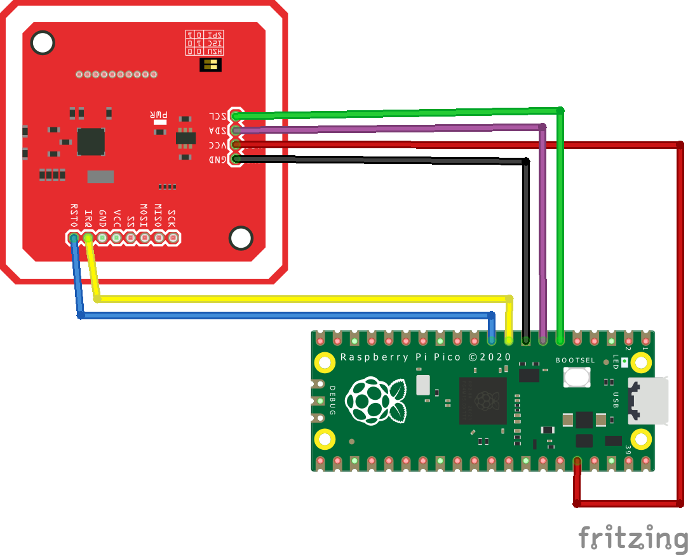

# NFC Reader for AsTeRICS-Grid

## Table of Contents

1. [Problem Description](#problem-description)
2. [Proposed Solution](#proposed-solution)
    - [Hardware/Software NFC Reader](#hardwaresoftware-nfc-reader)
    - [Android App with NFC](#android-app-with-nfc)
3. [Project Components](#project-components)
    - [Pico W NFC Reader](#pico-w-nfc-reader)
        - [Hardware Components](#hardware-components)
        - [3D Printed Enclosures](#3d-printed-enclosures)
        - [Connection Details](#connection-details)
        - [Pico W Firmware](#pico-w-firmware)
        - [Searching Data on NFC Tags](#searching-data-on-nfc-tags)
    - [NFC Tags](#nfc-tags)
        - [3D Objects for NFC Tags](#3d-objects-for-nfc-tags)
    - [Android App](#android-app)
4. [Future Improvements](#future-improvements)
5. [Documentation](#documentation)
    - [User Guide](#user-guide)
    - [Developer Guide](#developer-guide)
    - [Hardware Setup Guide](#hardware-setup-guide)
    - [3D Models and Printing Instructions](#3d-models-and-printing-instructions)

## Problem Description
Assistive Augmentative Communication (AAC) solutions, such as AsTeRICS-Grid, offer essential communication aids to individuals with speech and language impairments. However, the reliance on visual-based or complex input methods can limit accessibility for users with visual impairments, including blind individuals. There's a significant need for intuitive, non-visual alternative input methods to enhance interaction with AAC software for a broader range of users.

## Proposed Solution
Create an innovative Near Field Communication (NFC) reader that serves as an alternative and accessible input method for the AsTeRICS-Grid, an open-source AAC software. By leveraging NFC technology, users can interact with the AAC software through physical NFC tags, which are identifiable by touch. The project encompasses two complementary approaches:

1. **Hardware/Software NFC Reader**:
   - Design and build either a handheld NFC reader device or an extension for FABI, as an alternative input device for AsTeRICS-Grid. This involves creating a microcontroller-based system equipped with an NFC chip and custom electronic circuitry.
   - The device could be designed with tactile markers for easy operation by blind users, enabling them to read NFC tags and transmit the information to AsTeRICS-Grid via Web-Bluetooth or similar technologies.

2. **Android App with NFC**:
   - For users without access to the custom NFC reader, an Android app will replicate the device's functionality, utilizing the smartphone's built-in NFC reading capabilities.
   - The app will be designed with accessibility features (potentially including voice feedback and simple, intuitive gestures), ensuring blind and visually impaired users can effectively interact with it.

## Project Components

### Pico W NFC Reader

#### Hardware Components
- **Microcontroller**: Pico W
- **NFC Module**: V3 (PN532)

#### 3D Printed Enclosures
We have designed 3D printable enclosures for the NFC reader. The files for these designs are included in the repository. During the testing phase, we used PLA with 5-15% infill. For actual user application, a food-safe filament should be used to ensure safety.

#### Connection Details
To connect the NFC Module V3 (PN532) to the Pico W via I2C, follow these steps:

1. **Wiring Connections**:

   - PN532 SDA to Pico W GPIO2
   - PN532 SCL to Pico W GPIO3
   - PN532 IRQ to Pico W GPIO6
   - PN532 RSTO to Pico W GPIO7
   - PN532 VCC to Pico W 3.3V
   - PN532 GND to Pico W GND

2. **Power Supply**:
   - right now we use the USB_Connection as power supply.

#### Pico W Firmware
The firmware for the Pico W is written in C++ using the Arduino framework. The code handles NFC tag detection and data processing. The NFC reader inputs are currently processed as Huffman codes due to limitations in establishing a Bluetooth connection.

**Libraries Used**:
- `Wire.h`
- `SPI.h`
- `Adafruit_PN532.h`
- `Keyboard.h`

**Key Functionalities**:
- **Tag Detection**: The firmware continuously scans for NFC tags.
- **Data Retrieval**: Upon detecting a tag, it reads the data stored on the tag.
- **Data Processing**: The data is parsed to extract the object name and Huffman code for the grid.

#### Searching Data on NFC Tags
The data stored on the NFC tags includes the name of the object and the Huffman code for the grid. The data is delimited by specific markers:

- **Object Name**: The name of the object is stored between the markers `$AG$` and `$FE$`.
- **Huffman Code**: The Huffman code for the grid is stored between the markers `$AGT$` and `$FE$`.

The firmware searches for these markers to retrieve the relevant information:
1. **Search for Object Name**:
   - Scan the data for the `$AG$` marker.
   - Collect the text until the `$FE$` marker is found.
   - This collected text is the name of the object.
2. **Search for Huffman Code**:
   - Scan the data for the `$AGT$` marker.
   - Collect the text until the `$FE$` marker is found.
   - This collected text is the Huffman code for the grid.

### NFC Tags
We currently use NTAG215 tags, but the system is also compatible with NTAG213, NTAG216, and MIFARE tags. It is crucial that the necessary information is stored between the correct markers on the tags:

- **Object Name**: Stored between `$AG$` and `$FE$`.
- **Huffman Code**: Stored between `$AGT$` and `$FE$`.

#### 3D Objects for NFC Tags
We have also designed simple 3D objects to house the NFC tags. These objects are based on a cylinder with a diameter of 5 cm and a height of 2.5 cm. Different shapes, such as domes, cones, and cups, are placed on top of this cylindrical base. These designs help users easily identify the NFC tags by touch. The STL files for these objects are provided in the repository.

### Android App
The Android app is designed to provide similar functionality as the hardware NFC reader. The app uses the smartphone's built-in NFC capabilities and is designed with accessibility features to ensure usability by blind and visually impaired users. However, the integration with AsTeRICS-Grid and complete data processing from the NFC tags are not yet implemented. The app source code and installation instructions are provided in the `android_app` directory of this repository.

## Future Improvements
In the future, both the Pico W and the Android app will be able to connect to the AsTeRICS-Grid via Bluetooth. NFC tags will store complete grid information, allowing the device to be used on any PC without additional setup.

## Documentation

The following documents and resources are available to help you understand and work with the NFC Reader for AsTeRICS-Grid project:

### 1. User Guide
Detailed instructions on how to use the NFC reader and the Android app with AsTeRICS-Grid.

**Location**: `docs/user_guide.md`

**Contents**:

#### Grid Setup
1. **Create an Account**: On the first use, create an account on the AsTeRICS-Grid website.
2. **Import NFC-Grid**: From the repository, import the NFC-Grid as an example. Ensure to select "Import custom data from file."
3. **Configure Huffman Coding**: Enter the correct Huffman coding in the code and on the tags. Adjust both the `#define DELETE` function at the beginning of the code and the tags to match the Huffman code displayed in the Grid.

#### Connecting the NFC Reader to a PC
1. **Connect via USB**: Use a USB cable to connect the Pico W to your computer.
2. **Install Necessary Drivers**: Ensure that any necessary drivers for the Pico W are installed on your computer.
3. **Open AsTeRICS-Grid**: Open the AsTeRICS-Grid software on your computer with the NFC-Grid example loaded.
4. **Test the Connection**: Place an NFC tag near the reader and check if the data is correctly transmitted to AsTeRICS-Grid.

#### Using the Android App
1. **Install the App**: Download and install the NFC Reader app on your Android device.
2. **Enable NFC**: Ensure that NFC is enabled on your Android device.
3. **Open the App**: Launch the NFC Reader app.
4. **Scan an NFC Tag**: Place an NFC tag near your device’s NFC sensor and follow the prompts in the app.

#### Troubleshooting Common Issues
- **No Response from the NFC Reader**: Ensure all connections are secure and the Pico W is powered.
- **Data Not Displaying in AsTeRICS-Grid**: Verify that the correct firmware is uploaded and the drivers are installed.
- **Android App Not Scanning Tags**: Make sure NFC is enabled on your device and the tag is correctly positioned near the sensor.

### 2. Developer Guide
Comprehensive information for developers who want to contribute to the project or modify the existing setup.

**Location**: `docs/developer_guide.md`

**Contents**:

#### Project Structure
- **Firmware**: Located in the `firmware` directory.
- **Android App**: Located in the `android_app` directory.
- **3D Models**: Located in the `3d_models` directory.

#### Setting Up the Development Environment
1. **Clone the Repository**: Use `git clone` to download the project repository.
2. **Install Dependencies**: Use the Arduino Library Manager and Android Studio to install necessary dependencies.
3. **Build the Firmware**: Open the firmware code in the Arduino IDE, select the appropriate board and port, and upload the code to the Pico W.
4. **Build the Android App**: Open the Android app project in Android Studio, configure the SDK, and build the app.

#### Code Overview for the Pico W Firmware
- **Main Functions**: Description of the main functions, including `setup()`, `loop()`, `detectTag()`, and data processing functions.
- **Libraries Used**: Details on the libraries used (`Wire.h`, `SPI.h`, `Adafruit_PN532.h`, `Keyboard.h`).

#### Code Overview for the Android App
- **Main Components**: Description of the main components and activities in the app.
- **NFC Integration**: Details on how the app integrates with the device’s NFC hardware.

#### Guidelines for Adding New Features
- **Feature Requests**: How to submit and prioritize feature requests.
- **Development Standards**: Coding standards, documentation requirements, and testing procedures.

### 3. Hardware Setup Guide
Instructions on assembling the hardware components, including connecting the NFC module to the Pico W and 3D printing the enclosures.

**Location**: `docs/hardware_setup_guide.md`

**Contents**:

#### List of Hardware Components
- Pico W Microcontroller
- NFC Module V3 (PN532)
- USB Cable
- Breadboard and Wires (for prototyping)
- Power Supply (if needed for standalone operation)

#### Wiring Diagrams and Connection Details
1. **NFC Module to Pico W Connections (I2C)**:
   - PN532 SDA to Pico W GPIO2
   - PN532 SCL to Pico W GPIO3
   - PN532 IRQ to Pico W GPIO6
   - PN532 RSTO to Pico W GPIO7
   - PN532 VCC to Pico W 3.3V
   - PN532 GND to Pico W GND

#### 3D Printing Settings and Assembly Instructions
- **Printing Settings**:
  - Material: PLA for testing, food-safe filament for final use
  - Infill: 5-15%
  - Layer Height: 0.2 mm
  - Print Speed: 50 mm/s

- **Assembly Instructions**:
  1. **Print the Enclosures**: Use the provided STL files to print the enclosure parts.
  2. **Assemble the Hardware**: Place the Pico W and NFC Module inside the printed enclosure.
  3. **Secure the Components**: Ensure all components are securely fitted and the connections are stable.

### 4. 3D Models and Printing Instructions
Details about the 3D printed enclosures and NFC tag objects.

**Location**: `docs/3d_printing_guide.md`

**Contents**:

#### STL Files for Enclosures and NFC Tag Objects
- **Enclosure STL Files**: [Link to Enclosure STL Files](3D-Files/enclosure/)
- **NFC Tag Objects STL Files**: [Link to NFC Tag Objects STL Files](3D-Files/objects/)

#### Recommended Materials and Printing Settings
- **Materials**:
  - PLA for testing purposes.
  - Food-safe filament for final user application.

- **Printing Settings**:
  - Infill: 5-15%
  - Layer Height: 0.2 mm
  - Print Speed: 50 mm/s

#### Assembly Instructions
- **Enclosure Assembly**:
  1. Print the enclosure parts using the provided STL files.
  2. Assemble the printed parts to form the complete enclosure.
  3. Place the Pico W and NFC Module inside the enclosure and secure them.
  
- **NFC Tag Object Assembly**:
  1. Print the NFC tag objects using the provided STL files.
  2. Attach the NFC tags to the printed objects.
  3. Use the objects to identify NFC tags by touch.

---

Feel free to reach out if you have any questions or need further assistance with the project setup. Happy building!
